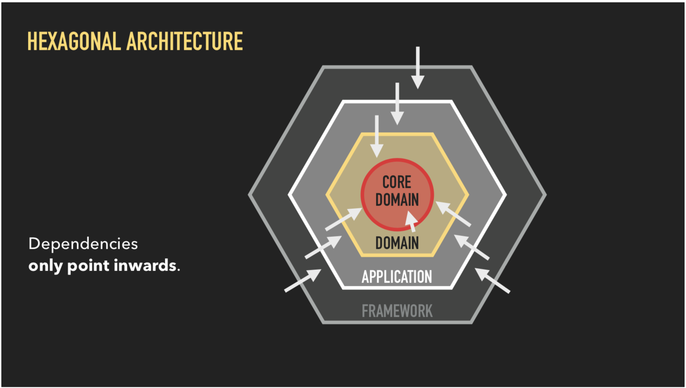

# Patients-api a simple backend project

## Overview

> Patient API is a project using Golang, Chi, PostrgreSQL among Docker and Docker compose and exposing REST API endpoints.

## Architecture

The app is designed to use hexagonal architecture. This helps to achieve the goal of being able to easily change one part of
the application without having to rewrite the entire thing. 

***The key rule in the hex model is that dependencies are only allowed to point inwards.***

## Endpoints

- `GET /api/v1/patients`    : Get all patients
- `GET /api/v1/patients/:id`:  Get one patient
- `POST /api/v1/patients`   :  Add one patient
